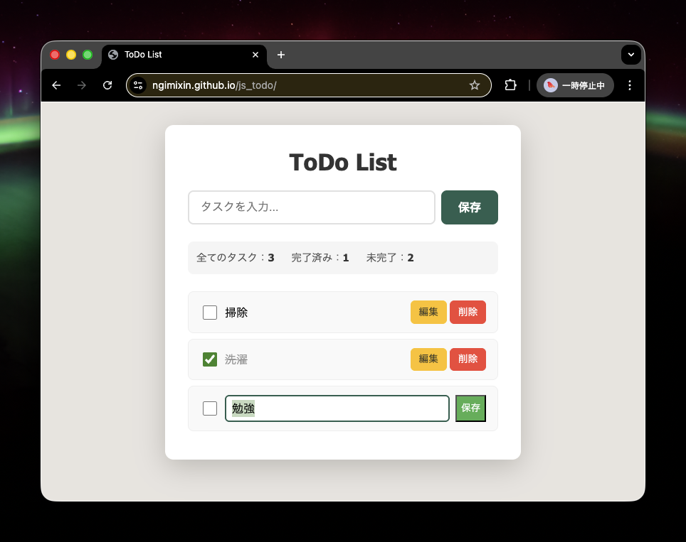
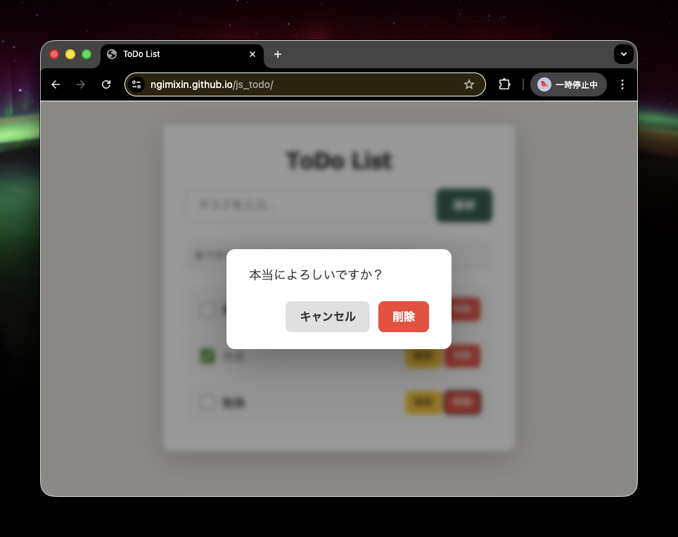

# js_todo

Vanilla JavaScriptで実装したToDo Listアプリ（CRUD練習）

## Demo

GitHub Pages で公開しています。

https://ngimixin.github.io/js_todo/

## Screenshot

### トップ画面

### 削除確認モーダル

## Usage

- リポジトリをクローンし、`index.html` をブラウザで開いてください。

## Features

- Create: タスク追加（localStorage保存）
- Read: 一覧表示 + 完了/未完了カウント
- Update: インライン編集（ESCキャンセル対応）
- Delete: カスタムモーダルによる削除確認（Enter/Escape対応）
- バリデーション: 空入力エラー表示

## Tech

- Vanilla JavaScript
- localStorage
- Event Delegation（イベント委譲）
